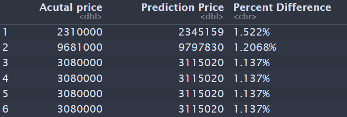

# House prices prediction

Data set [link](https://www.kaggle.com/datasets/yasserh/housing-prices-dataset). 

Predicted house prices from data set that contains 12 predictors and 545 observations. There is no missing values. The variables are the following:

`price` - Prices of home
`area` - Area of house
`bedrooms` - Number of house bedrooms
`bathrooms`- Number of house bathrooms
`stories` - Number of house stories
`mainroad` - Connected to main road (boolean)
`guestroom` - whether has a guest room (boolean)
`basement` - whether has a basement (boolean)
`hotwaterheating`- whether it has hot water heating
`airconditioning` - whether it has air condition
`parking` - Number of parking
`prefarea` - 
`furnishingstatus` - Furnishing status of house

The distribution of the `price` is below. The left distribution is right skewed, thus the variable `price` is transformed by taking the log. After making the prediction the it is transformed back to original scale. The prices of these houses ranges from 1.75 million to  13.3 million. 

The factors variables are converted to one-hot encoded for the purpose of modeling. There is 70%/30% split in the data and 5-fold cross validation is performed to determine the optimal mode.The Extreme Gradient Boosting (XGBOOST) is determine to be a good model to predict the price of a house. On average the XGBOOST is off about is $8,314.45 (Mean Absolute Error) which is is not to bad when considering the prices of the houses in these data set are in millions.

The images below show the table of the first 6 observation of the actual price and predicted price.

